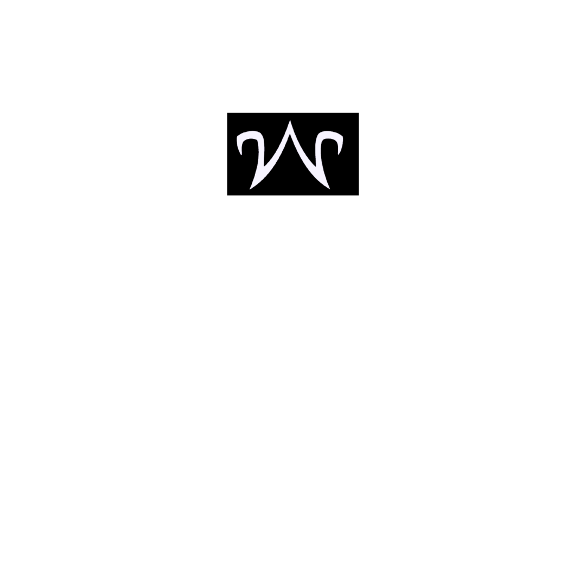

<a name="readme-top"></a>

  <!-- PROJECT SHIELDS -->

[![Contributors][contributors-shield]][contributors-url]
[![LinkedIn][linkedin-shield]][linkedin-url]

  <!-- PROJECT LOGO -->

  <br />
  <div align="center">
    <a href="https://github.com/will10iam/app-portfolio">
      
    </a>
    <h3 align="center">Meu Portfolio!</h3>
    <p align="center">
    <br/>
Esse é o meu site!  Você vai conhecer mais de mim e dos meus projetos.  Tem uma aparência dinâmica e atraente. Não acha? <br/>
      <br/>
      Desenvolvido por - William Berbet
      <br/>
      <br/>
      <a href="https://github.com/will10iam/app-portfolio"><strong>Explore os códigos »</strong></a>
      <br/>
      <br/>
      <a href="https://wiillportfolio.netlify.app/">Ver o Website</a>
      ·
      <a href="https://github.com/will10iam/app-portfolio/issues">Reporte algum bug</a>
    </p>
  </div>
  

  
  <!-- ABOUT THE PROJECT -->
  
  ## Sobre o Projeto
  
  ### Imagens
  
  [![My React Portfolio Screen Shot][product-screenshot]](https://wiillportfolio.netlify.app/)

[![My React Portfolio Screen Shot][product-screenshot2]](https://wiillportfolio.netlify.app/)

[![My React Portfolio Screen Shot][product-screenshot3]](https://wiillportfolio.netlify.app/)

[![My React Portfolio Screen Shot][product-screenshot4]](https://wiillportfolio.netlify.app/)

  <p align="right"><a href="#readme-top">voltar ao top</a></p>
  
  ### Desenvolvido com
  
  - 

  <p align="right"><a href="#readme-top">voltar ao top</a></p>
  
  ### Descrição
  
  Bem vindo ao meu portfolio, construído com React. Aqui você vai ver meus melhores projetos. O projeto tem uma grande enfase no conceito mobile-first, oferecendo uma aparência profissional e polida!
  
  <p align="right"><a href="#readme-top">voltar ao top</a></p>

<!-- GETTING STARTED -->

## Para usar

Quer ter uma cópia local?  - Siga os passos abaixos:

### Pré-requisitos

- npm
  ```sh
  npm install npm@latest -g
  ```

### Instalação

1. Clone the repo
   ```sh
   git clone https://github.com/will10iam/app-portfolio.git
   ```
2. Install NPM packages
   ```sh
   npm install
   ```

  <p align="right"><a href="#readme-top">voltar ao top</a></p>
  
  
  ### Versão Mobile
  
  - Todo o aplicativo foi projetado para ser responsivo e ajustar-se em vários tamanhos de tela. Confira nas imagens:
  
    [![Responsiveness Screenshot][responsive-screenshot]](https://michaelyeates.co.uk)
    
    [![Responsiveness Screenshot][responsive-screenshot2]](https://michaelyeates.co.uk)

    [![Responsiveness Screenshot][responsive-screenshot3]](https://michaelyeates.co.uk)

    [![Responsiveness Screenshot][responsive-screenshot4]](https://michaelyeates.co.uk)

  <p align="right"><a href="#readme-top">voltar ao top</a></p>
  
<!-- QUESTIONS -->
  
## Questões

Se tiver alguma dúvida, me mande!  Pode ser no email - <a href="mailto:wiiliamb@hotmail.com">wiiliamb@hotmail.com</a> ou nas redes sociais!

<a href="https://www.linkedin.com/in/william-berbet/">LinkedIn</a> | <a href="https://github.com/will10iam">GitHub</a> | <a href="https://www.instagram.com/willnasredes/">Instagram</a>

Link do Projeto: [https://github.com/will10iam/app-portfolio](https://github.com/will10iam/app-portfolio)

  <p align="right"><a href="#readme-top">back to top</a></p>
  
  <!-- MARKDOWN LINKS & IMAGES -->

[contributors-shield]: https://img.shields.io/github/contributors/mdyeates/my-portfolio.svg?style=for-the-badge
[contributors-url]: https://github.com/mdyeates/my-portfolio/graphs/contributors
[forks-shield]: https://img.shields.io/github/forks/mdyeates/my-portfolio.svg?style=for-the-badge
[forks-url]: https://github.com/mdyeates/my-portfolio/network/members
[stars-shield]: https://img.shields.io/github/stars/mdyeates/my-portfolio.svg?style=for-the-badge
[stars-url]: https://github.com/mdyeates/my-portfolio/stargazers
[issues-shield]: https://img.shields.io/github/issues/mdyeates/my-portfolio.svg?style=for-the-badge
[issues-url]: https://github.com/mdyeates/my-portfolio/issues
[license-shield]: https://img.shields.io/github/license/mdyeates/my-portfolio.svg?style=for-the-badge
[license-url]: https://github.com/mdyeates/my-portfolio/blob/main/LICENSE.md
[linkedin-shield]: https://img.shields.io/badge/-LinkedIn-black.svg?style=for-the-badge&logo=linkedin&colorB=555
[linkedin-url]: https://linkedin.com/in/mdyeates

  <!-- UPDATE PLACEHOLDER IMAGES HERE -->

[product-screenshot]: src/Assets/screenshot.png
[product-screenshot2]: src/Assets/screenshot1.png
[product-screenshot3]: src/Assets/screenshot2.png
[product-screenshot4]: src/Assets/screenshot3.png
[responsive-screenshot]: src/Assets/mobile-screenshot.png
[responsive-screenshot2]: src/Assets/mobile-screenshot1.png
[responsive-screenshot3]: src/Assets/mobile-screenshot2.png
[responsive-screenshot4]: src/Assets/mobile-screenshot3.png
